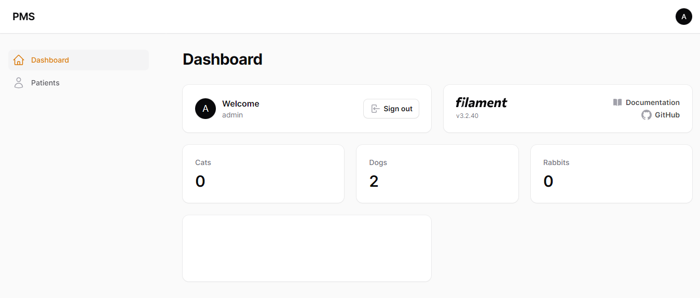

# PMS

Is a simple patient management system for a veterinary practice using Filament. Filament PHP is a Laravel Package written on to for Laravel, Livewire, Tailwind CSS and Apline JS.

## Resources

[FilamentPHP](https://filamentphp.com/)
[Laravel LiveWire](https://livewire.laravel.com/)

## Includes

-   Patients Modal
-   Owners Modal
-   Treatments Modal

## Screenshots

